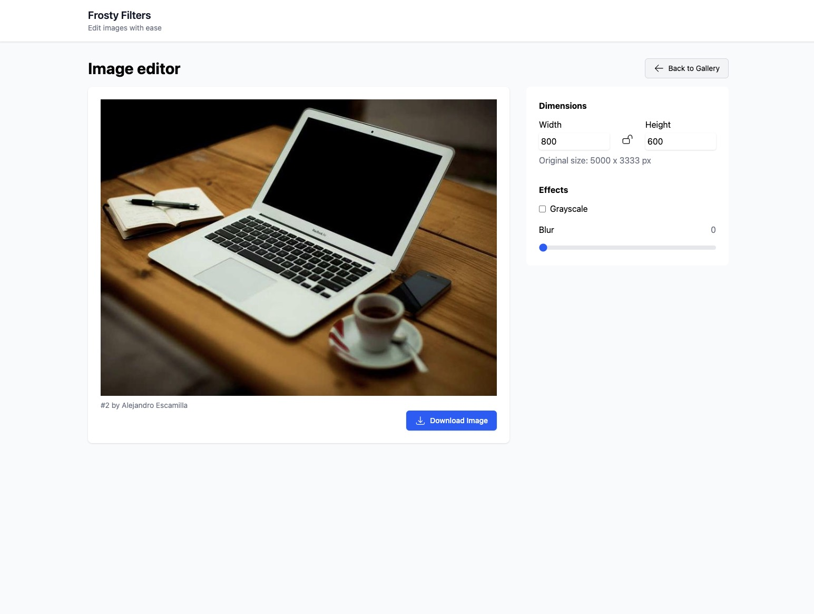

#  Frosty Filters

An image editing tool that allows users to edit and download images from [Lorem Picsum](https://picsum.photos/).

## Features

- Browse and select images from Lorem Picsum gallery
- Adjust image dimensions with aspect ratio lock
- Apply effects:
  - Grayscale conversion
  - Blur adjustment
- Real-time preview
- Download modified images
- Responsive design
- URL-based state management for shareable edits

## Architecture

- **React** for UI components
- **Redux Toolkit** with RTK Query for API integration
- **React Router** for routing and URL-based state
- **TailwindCSS** for styling
- **Zod** for runtime type validation
- **React Intl** for i18n

## File Structure

The project is organized as follows:

```
/src
  ├── assets/                # Static assets like localization files
  ├── components/            # Reusable UI and feature components
  │   ├── ImageEditor/       # Components for the image editor page
  │   ├── ImageGallery/      # Components for the image gallery page
  │   ├── Layout/            # Layout components like Header and Container
  │   ├── NotFound/          # 404 Not Found page components
  │   └── ui/                # Shared UI components (e.g., Button, Checkbox)
  ├── hooks/                 # Custom React hooks
  ├── services/              # API services and utilities
  │   ├── picsum/            # Picsum API integration
  ├── store/                 # Redux store configuration
  ├── test/                  # Test setup and utilities
  ├── utils/                 # Utility functions (e.g., route helpers)
  ├── App.tsx                # Main application component
  ├── main.tsx               # Application entry point
  ├── index.css              # Global styles
  └── vite-env.d.ts          # Vite environment types
```

## Candidate Task: Implement the Image Editor Page

The `ImageEditor` page and the `getImageInfo` query have been removed for this exercise. Your task is to implement them based on the following requirements:

### Requirements

1. **Display a preview of the image**:

   - Display a preview of the image

2. **Image Controls**:

   - Allow users to adjust the image dimensions, apply greyscale and blur effects

3. **Download Functionality**:

   - Enable users to download the modified image

4. **Shareable links**:

   - Allow users to share links that maintain the edited image state (dimensions, effects).

5. **API Query**:
   - Implement a `getImageInfo` query to fetch metadata for a specific image.

### Helpful Context

- **Utilities**:

  - `createImageUrl` in `src/services/picsum/utils/createImageUrl.ts` generates image URLs.
  - `makeEditorRoute` in `src/utils/makeRoutes.ts` helps construct routes for editing an image.

- **Hooks**:

  - `useLazyDownloadImageQuery` handles image downloads.

- **Styling**:
  - TailwindCSS is used for styling. Refer to existing components for examples. Some reusable components are provided within the ui folder.

### Design Reference

A `design.jpg` file is included in the project, which provides a reference for the UI design of the `ImageEditor` page. While you are encouraged to follow this design, we welcome any changes or optimizations you think would improve the user experience or functionality.



### Review Existing Code

Before starting, review the existing codebase, especially the `ImageGallery` components, to familiarize yourself with the app's structure and functionality. Check for any bugs, typos, or errors that might need fixing to ensure a smooth development process.

### Testing

- Ensure the implementation is responsive and works across different screen sizes.
- Write unit tests for any new utilities or components you create.

Good luck, and feel free to ask questions during the exercise!
